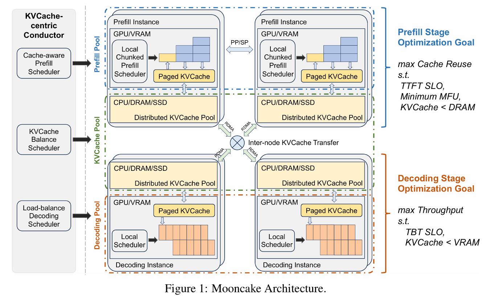

# 基于内存池优化的LLM推理系统

## 研究背景

### 1. 推理中的 KV Cache
大模型推理可以分为 Prefill 和 Decode 两个过程，Prefill 阶段指的是模型一次性读取并对全部输入 token 做一次前向计算，主要影响首字延迟（TTFT）；而 Decode 阶段则是模型以 Prefill 的结果以及以前 Decode 过程的输出 token 为输入逐步生成新 token，称为“自回归生成”。这个过程是严格串行的，主要影响字间延迟（TBT）。在推理过程中，我们可以将前面token 的 attention 计算中的K和V存储起来，从而避免昂贵的重复计算，实现以空间换计算的效果。

### 2. Prefix Reuse
Prefix Reuse（前缀复用）是一种在大模型推理过程中提升效率的技术。其核心思想是在多轮推理或批量推理场景下，对于输入序列中相同的前缀部分，只需进行一次 Prefill 计算并缓存其结果（KV Cache），后续推理可以直接复用这些缓存，避免重复计算。这不仅显著降低了计算资源消耗，还能有效缩短推理延迟，尤其在多用户或多任务共享相同上下文时优势更加明显。如下图表格数据所示，在 QA 和 Tool-use 任务里，Prompt 的共享率都能达到 85% 以上，说明前缀复用在真实场景中有很高的价值。

### 3. KV cache 的存储和调度问题
随着大模型推理场景的不断扩展，KV cache 的存储和调度问题变得尤为突出。由于每个推理请求都可能产生大量的 KV 数据，整体缓存规模在实际系统中往往达到数十 TB 甚至更高。比如统计发现，在 Arxiv 数据集上到 2023 年 10 月约有 130 亿 token，DeepSeek-V3 仅缓存 KV 结果就占用了 848TB 存储。如果仅依赖 GPU 显存进行存储，不仅成本高昂，而且容量受限，难以满足大规模应用需求。因此，业界开始探索利用分布式架构，将 KV cache 分散存储在多台机器的 CPU 内存或 SSD 上，并通过高效的调度机制实现数据的快速访问和复用。如下图即为 Mooncake 的架构图，其利用多台机器的 DRAM 构建了分布式内存池，大大提高了 KV Cache 容量及命中率。

### 4. 分布式内存池存在的问题
在分布式内存池架构下，虽然可以显著提升 KV cache 的存储容量和命中率，但也带来了新的挑战。尤其是在端侧（如推理节点）访问 KV cache 时，可能出现多打一（N-to-1）的流量冲突问题。具体来说，当多个推理请求同时需要访问同一个 KV cache 分片或节点时，会导致网络拥塞和存储节点的访问压力骤增，进而影响整体系统的响应速度和稳定性。这种流量冲突不仅可能造成数据访问延迟，还会影响分布式系统的负载均衡和扩展性。因此，如何高效调度 KV cache 的传输、优化数据分布和访问策略，是分布式内存池设计中亟需解决的关键问题。

## 拟研究项目

针对分布式内存池在端侧访问 KV cache 时可能出现的多打一流量冲突问题，我们计划在交换机上引入在网内存池的设计方案。通过在交换机侧部署高性能内存池，实现 KV cache 的存储和分发，支持多个推理节点同时高效访问同一份 KV cache 数据。这样不仅能够显著缓解网络拥塞和存储节点压力，还能提升系统整体的响应速度和扩展性。该方案利用交换机的高速转发能力和内存资源，实现 KV cache 的高并发访问和智能调度，为大规模 LLM 推理系统提供更优的基础设支持。

### 需要解决的问题：

1. **内存池空间有限，数据选择需精细化**  
   内存池容量有限，无法存放所有 KV cache 数据。需要设计有效的机制，识别哪些前缀具有较高复用价值，优先存入内存池，而低价值或低复用率的数据则保留在本地或其他层级存储。

2. **多层存储的数据流动与调度策略**  
   KV cache 在 GPU 显存、节点本地 DRAM、远端 DRAM、内存池等多层存储间流动时，需制定高效的数据迁移策略。需明确数据在不同层级间的上升与下降时机，实现性能与容量的动态平衡。

3. **内存池淘汰机制与价值回收**  
   由于内存池容量有限，需定期淘汰部分数据。淘汰时不仅要考虑直接丢弃，还需评估数据的剩余价值，探索是否有必要进行价值回收或迁移到其他存储层级。

4. **通信与管理开销的收益评估**  
   内存池提升复用率的同时，也带来额外的通信、调度和管理开销。需量化不同规模下的收益与成本，确定在何种场景和规模下，内存池方案能够带来净

## 推荐论文
- **Mooncake: A KVCache-centric Disaggregated Architecture for LLM Serving**
- **CacheGen: KV Cache Compression and Streaming for Fast Large Language Model Serving**
- **CacheBlend: Fast Large Language Model Serving for RAG with Cached Knowledge Fusion**
- **KVCache Cache in the Wild: Characterizing and Optimizing KVCache Cache at a Large Cloud Provider**
- **SparseServe: Unlocking Parallelism for Dynamic Sparse Attention in Long-Context LLM Serving**