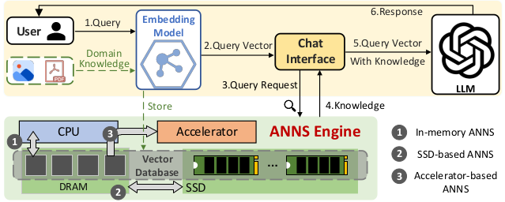
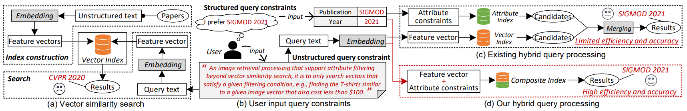

# 近似最近邻搜索（ANNS）

## 联系方式

- **负责人**：赵可泰，[陈力峥](https://cookiecoolkid.github.io/)
- **邮箱**：502025330076@smail.nju.edu.cn & lizhengchen@smail.nju.edu.cn

在信息检索与机器学习中，常见的做法是将文本、图像、视频、语音等非结构化数据，通过 **embedding 模型** 映射到高维向量空间。此时，数据之间的语义关系可以通过 **距离度量（如欧氏距离、余弦相似度）** 来刻画：相似的数据点在向量空间中往往距离较近。由此引出 **最近邻搜索（Nearest Neighbor Search, NNS）** 问题：给定一个查询向量，召回数据集中与其最接近的点。  
然而，当数据规模达到百万、甚至十亿级别，同时维度上百甚至上千时，精确最近邻搜索的代价极其高昂，无法满足低延迟应用需求。为此提出了 **近似最近邻搜索（Approximate Nearest Neighbor Search, ANNS）**，它在保证高召回率的同时显著降低搜索时间和存储成本，成为现代 **大规模向量检索系统** 的核心技术。  

随着 **大语言模型（LLM）** 与 **多模态模型** 的发展，ANNS 已成为其外部知识接入与语义检索的关键技术。

- 在 **RAG（Retrieval-Augmented Generation）** 中，ANNS 负责从向量数据库中检索相关知识，支撑 LLM 生成更准确的回答。  
- 在 **多模态检索** 中，ANNS 为跨模态 embedding 提供统一的索引与匹配能力。  

  

近年来，ANNS 的主流研究方法大致有以下几种：

- **基于哈希的索引（Hashing-based）**：通过局部敏感哈希（LSH）等方法将相似向量映射到相同桶中，以加速候选集合的生成。  
- **基于树的索引（Tree-based）**：利用空间划分（如 KD-tree）实现高效剪枝，但在高维大规模场景下易退化。
- **基于图的索引（Graph-based）**：构建稀疏近邻图（如 HNSW），通过启发式图搜索快速收敛到查询点的近邻。

其中，**图索引方法在实践中表现最为突出**，既能保持较高的召回精度，又在查询延迟与内存占用之间取得良好平衡，已成为工业界和学术界的主流选择。

> - Malkov & Yashunin, **TPAMI 2018**. *Efficient and Robust Approximate Nearest Neighbor Search Using Hierarchical Navigable Small World Graphs*.  
> - S. Jayaram Subramanya, F. Devvrit, et al., **NeurIPS 2019**. *DiskANN: Fast Accurate Billion-Point Nearest Neighbor Search on a Single Node*.  
> - M Wang, X Xu, Q Yue, Y Wang., **VLDB 2021**. *A Comprehensive Survey and Experimental Comparison of Graph-Based Approximate Nearest Neighbor Search*

---

## ANNS 混合检索（ANNS Over Hybrid Query）

### 研究背景

- 单一模态或单一索引难以满足真实需求，用户往往需要 **多维条件结合**（如“找评分最高的、同时和某主题最相关的文档”）。  
- 在 **RAG 场景** 下，ANNS 检索的非结构化知识常需要与 **数据库属性查询** 或 **知识图谱约束** 联合，才能生成可靠答案。  
- 在 **多模态检索** 中（文本、图像、视频、音频），ANNS 需处理 **异构 embedding** 并支持统一查询。  
- 因此，混合检索的研究重点在于：**如何在向量索引与传统数据库索引之间高效协同，实现结构化与非结构化数据的统一检索**。  

### 推荐阅读
- W. Wei, et al., **VLDB 2020**. *AnalyticDB-V: A Hybrid Analytical Engine Towards Query Fusion for Structured and Unstructured Data*.  
- Y. Wang, et al., **2022**. *Navigable Proximity Graph-Driven Native Hybrid Queries with Structured and Unstructured Constraints*.  
- A. Gollapudi, et al., **WWW 2023**. *Filtered-DiskANN: Graph Algorithms for Approximate Nearest Neighbor Search with Filters*.  
- M. Patel, et al., **SIGMOD 2024**. *ACORN: Performant and Predicate-Agnostic Search Over Vector Embeddings and Structured Data*.  
- Z. Cai, et al., **SIGMOD 2025**. *Navigating Labels and Vectors: A Unified Approach to Filtered Approximate Nearest Neighbor Search*.  

---

## 流式 ANNS（Streaming / Dynamic ANNS）

### 研究背景

- 传统 ANNS 系统大多为 **静态索引**，在构建后只适合批量查询，难以适应数据的频繁更新。  
- 在 **真实业务系统** 中，如推荐、日志监控、搜索引擎等场景，数据是 **持续到达与变化的流**：  
  - **RAG 服务**：知识库需实时扩充与更新，否则 LLM 检索结果会滞后于最新事实。  
  - **在线推荐与风控**：用户行为与风险特征不断变化，要求索引支持快速插入和删除。  
- 因此，流式 ANNS 的核心挑战是同时保证 **低延迟查询** 与 **高吞吐更新**，推动了动态图索引结构和增量维护策略的发展。  

### 推荐阅读
- W. Wei, et al., **VLDB 2020**. *AnalyticDB-V: A Hybrid Analytical Engine Towards Query Fusion for Structured and Unstructured Data*.  
- A. Singh, S. J. Subramanya, R. Krishnaswamy, et al., **arXiv 2021**. *FreshDiskANN: A Fast and Accurate Graph-Based ANN Index for Streaming Similarity Search*.  
- H. Xu, M. D. Manohar, P. A. Bernstein, B. Chandramouli, R. Wen, H. V. Simhadri, **arXiv 2025**. *In-Place Updates of a Graph Index for Streaming Approximate Nearest Neighbor Search*. 

---

**也欢迎任何其他你感兴趣的与ANNS相关的方向 ～**

---
