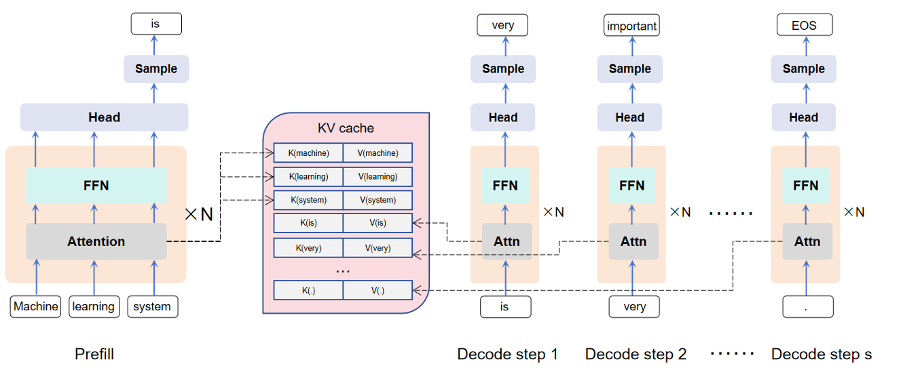
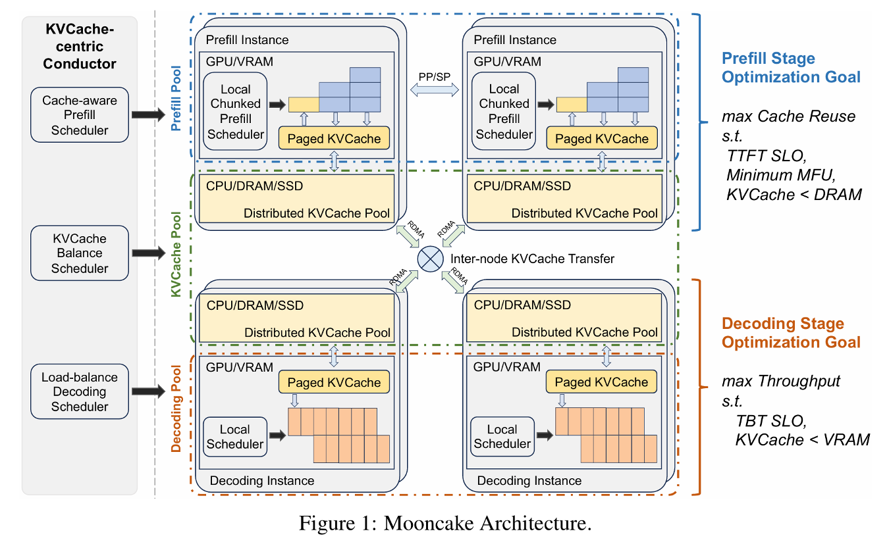

# 基于分布式内存池的LLM推理系统

## 研究背景

### 1. 推理中的 KV Cache
大模型推理可以分为 Prefill 和 Decode 两个过程，Prefill 阶段指的是模型一次性读取并对全部输入 token 做一次前向计算，主要影响首字延迟（TTFT）；而 Decode 阶段则是模型以 Prefill 的结果以及以前 Decode 过程的输出 token 为输入逐步生成新 token，称为“自回归生成”。这个过程是严格串行的，主要影响字间延迟（TBT）。在推理过程中，我们可以将前面token 的 attention 计算中的K和V存储起来，从而避免昂贵的重复计算，实现以空间换计算的效果。

### 2. Prefix Reuse
Prefix Reuse（前缀复用）是一种在大模型推理过程中提升效率的技术。其核心思想是在多轮推理或批量推理场景下，对于输入序列中相同的前缀部分，只需进行一次 Prefill 计算并缓存其结果（KV Cache），后续推理可以直接复用这些缓存，避免重复计算。这不仅显著降低了计算资源消耗，还能有效缩短推理延迟，尤其在多用户或多任务共享相同上下文时优势更加明显。如下图表格数据所示，在 QA 和 Tool-use 任务里，Prompt 的共享率都能达到 85% 以上，说明前缀复用在真实场景中有很高的价值。

### 3. KV cache 的存储和调度问题
随着大模型推理场景的不断扩展，KV cache 的存储和调度问题变得尤为突出。由于每个推理请求都可能产生大量的 KV 数据，整体缓存规模在实际系统中往往达到数十 TB 甚至更高。比如统计发现，在 Arxiv 数据集上到 2023 年 10 月约有 130 亿 token，DeepSeek-V3 仅缓存 KV 结果就占用了 848TB 存储。如果仅依赖 GPU 显存进行存储，不仅成本高昂，而且容量受限，难以满足大规模应用需求。因此，业界开始探索利用分布式架构，将 KV cache 分散存储在多台机器的 CPU 内存或 SSD 上，并通过高效的调度机制实现数据的快速访问和复用。如下图即为 Mooncake 的架构图，其利用多台机器的 DRAM 构建了分布式内存池，大大提高了 KV Cache 容量及命中率。

## 拟研究项目