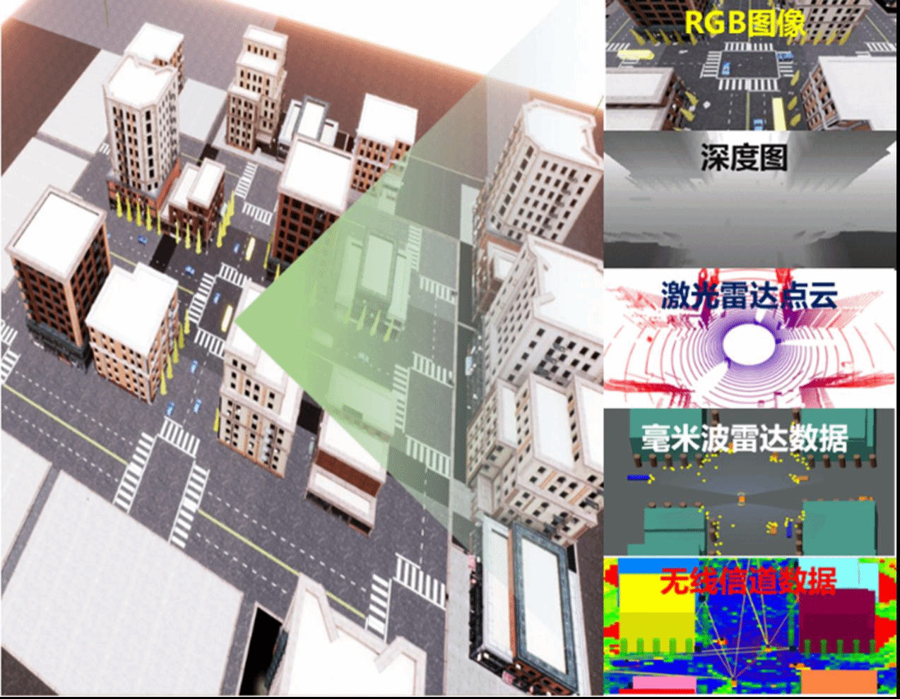
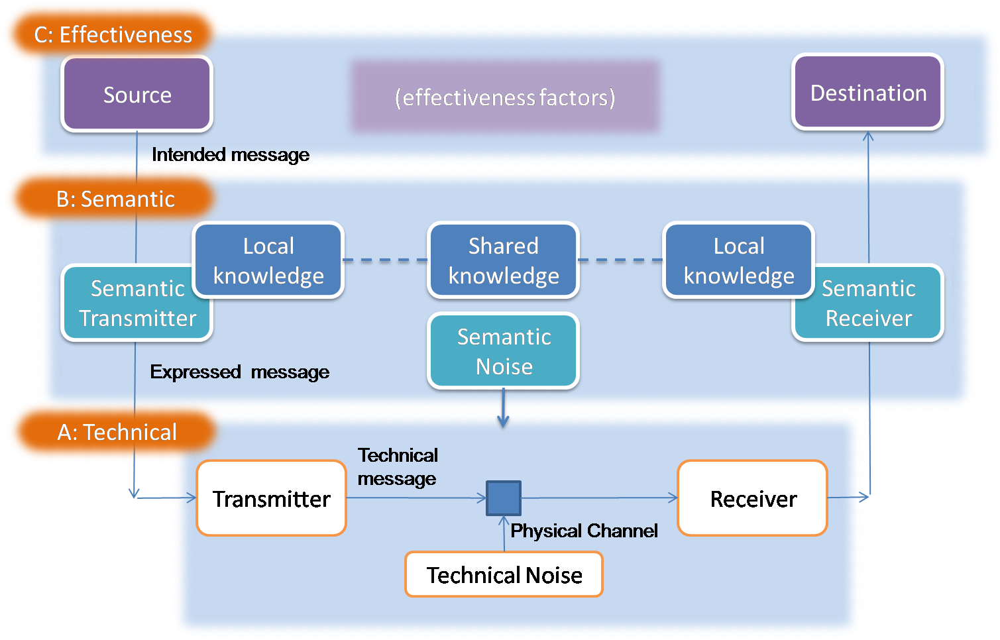

# 研究方向
## 1. 多模态通感一体化  

**多模态通感一体化（Integrated Sensing and Communication, ISAC）** 通过同时利用多种传感模态（如射频信号、视觉图像、点云数据等）来提升通信与感知的协同性能。其基本原理是在共享的硬件和频谱资源上实现感知与通信的联合设计与优化。相比传统单模态ISAC仅依赖单一信息源、难以在复杂环境下保证稳定性，多模态ISAC通过异构模态的互补性，在信息提取阶段利用各自的特征优势，并通过跨模态融合机制实现对目标与环境的更全面感知。同时，利用提取到的语义信息优化通信信道的传输与资源分配，从而在动态多变的场景中实现**高可靠感知与高效通信**的双重目标。  

**代表性成果：**  
- [1] Y. Peng, L. Xiang, K. Yang, et al. *Simac: A semantic-driven integrated multimodal sensing and communication framework*, IEEE Journal on Selected Areas in Communications, 2025. (大修)  
- [2] Y. Peng, L. Xiang, K. Yang, et al. *Semantic communications with computer vision sensing for edge video transmission*, IEEE Transactions on Mobile Computing, 2025. (大修)  

---

## 2. 语义通信  

**语义通信** 的原理在于跳过传统通信中逐比特、逐符号的传输方式，转而直接传递信息的“语义”——即任务相关且有价值的核心意义。其核心思想是先对源信息进行语义级别的提取与表示，例如通过深度学习模型将语音、图像或文本压缩为与任务目标相关的语义特征，再通过信道传输这些紧凑的表示。接收端不再机械地恢复原始比特流，而是基于语义特征重建或生成满足任务需求的信息，从而显著降低冗余数据传输，提高通信效率与鲁棒性，尤其适用于带宽受限或信道不稳定的场景。  

**代表性成果：**  
- [1] F. Jiang, L. Dong, Y. Peng*, et al., "Large AI Model Empowered Multimodal Semantic Communications," *IEEE Communications Magazine*, vol. 63, no. 1, pp. 76-82, Jan. 2025.  
- [2] F. Jiang, Y. Peng*, L. Dong, et al., "Large Language Model Enhanced Multi-Agent Systems for 6G Communications," *IEEE Wireless Communications*, vol. 31, no. 6, pp. 48-55, Dec. 2024.  
- [3] F. Jiang, Y. Peng*, L. Dong, et al., "Large AI Model-Based Semantic Communications," *IEEE Wireless Communications*, vol. 31, no. 3, pp. 68-75, Jun. 2024.  

---

## 3. 联邦学习  

**联邦学习（Federated Learning, FL）** 的原理是在保证数据隐私的前提下，实现多设备或多节点的协同建模。各参与方（如终端设备、边缘节点）不上传本地原始数据，而是利用本地数据独立训练模型，并仅将模型参数或梯度上传至中央服务器或聚合器；服务器再对来自不同节点的更新结果进行聚合（如加权平均），得到全局模型并下发至各节点，完成迭代更新。通过这种方式，联邦学习既能充分利用分散的数据资源训练高性能模型，又能保护用户隐私、降低数据传输开销，并增强系统在跨域、异构环境下的适应性。  

**代表性成果：**  
- [1] Y. Peng, F. Jiang, L. Dong, K. Wang and K. Yang, "Personalized Federated Learning for GAI-Assisted Semantic Communications," *IEEE Transactions on Cognitive Communications and Networking*, 2025.  
- [2] L. Dong, Y. Peng*, F. Jiang, K. Wang and K. Yang, "Explainable Semantic Federated Learning Enabled Industrial Edge Network for Fire Surveillance," *IEEE Transactions on Industrial Informatics*, vol. 20, no. 12, pp. 14053-14061, Dec. 2024.  
- [3] Y. Peng, F. Jiang, S. Tu, L. Dong, K. Wang and K. Yang, "Dynamic Client Scheduling Enhanced Federated Learning for UAVs," in IEEE Wireless Communications Letters, vol. 13, no. 7, pp. 1998-2002, July 2024, doi: 10.1109/LWC.2024.3400813.
---

# 拟研究项目
### 1. 弱网视频通话场景的极低码率AI视频编解码  
本课题聚焦在弱网环境下的视频通话体验提升，目标是研发一种极低码率下仍能保持可感知质量的AI视频编解码方法。研究将通过语义压缩与生成模型相结合，将视频信号转化为紧凑的语义特征进行传输，并在接收端通过生成网络重建高质量视频，从而显著降低带宽占用并保证实时性。  

### 2. 基于Agent的自适应设备接入  
本课题旨在构建一个基于智能Agent的自适应设备接入策略，通过状态感知和智能决策机制动态选择最优的感知设备与通信链路。研究重点在于利用大模型或强化学习驱动的推理方法，对环境状态、任务需求和网络负载进行联合分析，避免冗余接入和无效传输，从而提升多设备协同下的感知准确率与通信效率。  

### 3. 水下语义通信的实物仿真系统  
本课题拟设计并搭建一个面向水下环境的语义通信实验平台，利用实际声学或光学信道对语义信息传输过程进行仿真验证。研究将聚焦水下信道噪声强、带宽窄的特点，开发适应性的语义提取、压缩与重建算法，并通过实物系统测试验证其在水下监测、通信和协同任务中的可行性与性能优势。  

